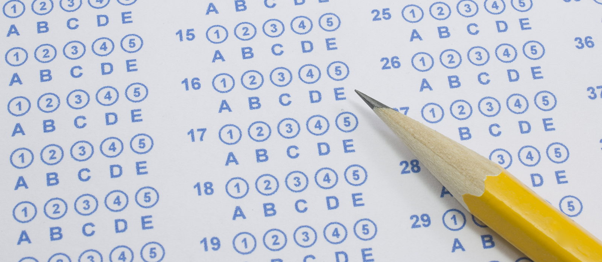
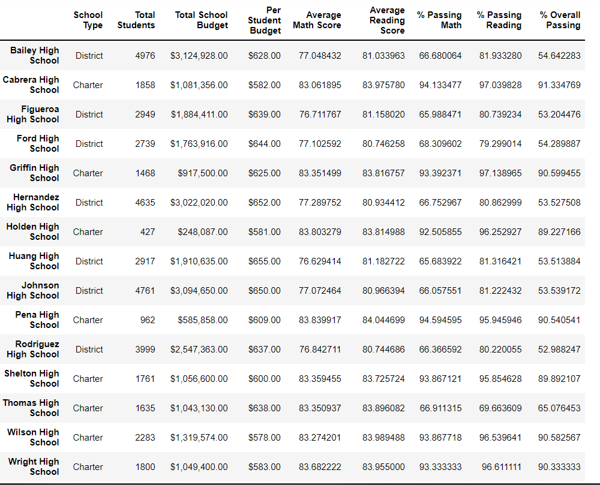
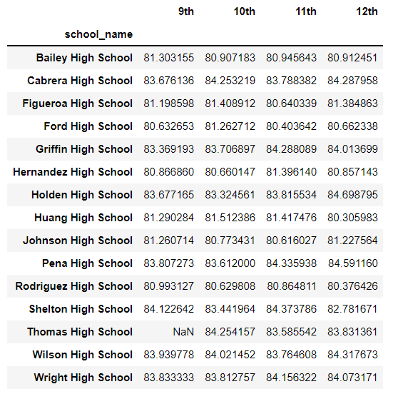
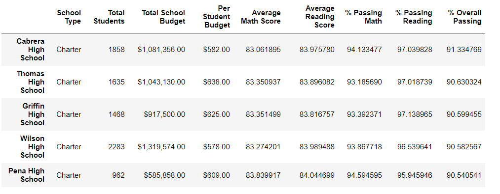
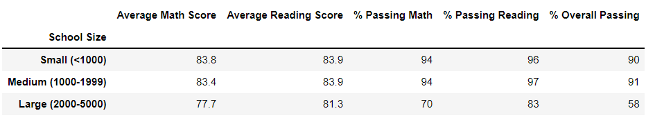
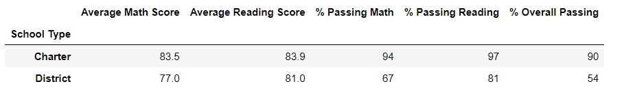

# week4_School_District_Analysis

# Overview of the school district analysis:
Every year, schools undergo standardized testing issued by the state in order to assess how well the students have performed. These tests cover math and reading, which will be used for analysis to gain insight into performance trends and patterns at the school and district level. I was tasked with helping analyze the data on student funding and students’ standardized test scores. This data represents 15 schools and 39,170 students. My analysis will assist the school board and superintendent in making decisions regarding the school budgets and priorities.

# Initial Results:

After performing hundreds of line of code (too much to screenshot and post), my initial results pleased the school board! However, this analysis led to the discovery of academic dishonesty; specifically with the reading and math grades for ninth graders at Thomas High School. My new task was to replace those test scores with NaN and keep the rest of the data intact. As you can see, the original outcome for Thomas High School was: 66.91% passing math, 69.66% passing reading, and 65.07% overall passing.

After taking care of the 9th grader data for Thomas High School, you can see a significant change in the passing percentages for that school.

The percentages for Thomas High School have gone up! Now it's 93.18% passing math, 97.01% passing reading, and 90.63% overall passing. The image above is also an example of how this change in the data has impacted the story. This is an image of the top 5 performing schools, which Thomas High School wasn't on before. Since the analysis is on 15 different schools, all this data adds up. However, in some areas there's less of an impact. 

Thomas High School is a medium sized charter school. So in the categories of size and type of school, it plays a role in the data on that front. However, even this data hardly moved because there's so many grades between all the schools. 15 schools and 4 grades adds up to 60 grades in total. Which means we changed 0.017% of the overall data. Our updated code is useful for gaining an understanding of the performance of that particular school. Beyond that, the big picture of the story is the same. The larger the school; the worse they perform on both reading and math tests. Larger schools even spend more on their students, and that doesn't counter balance the perks of going to a smaller school. In addition, charter schools do significantly better than district schools.